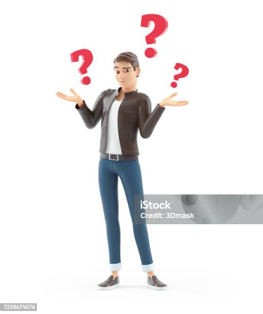
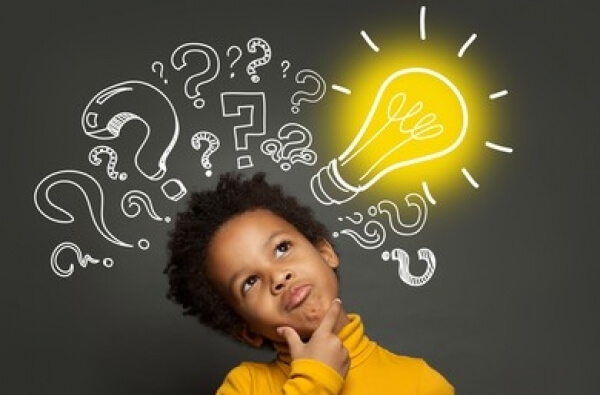
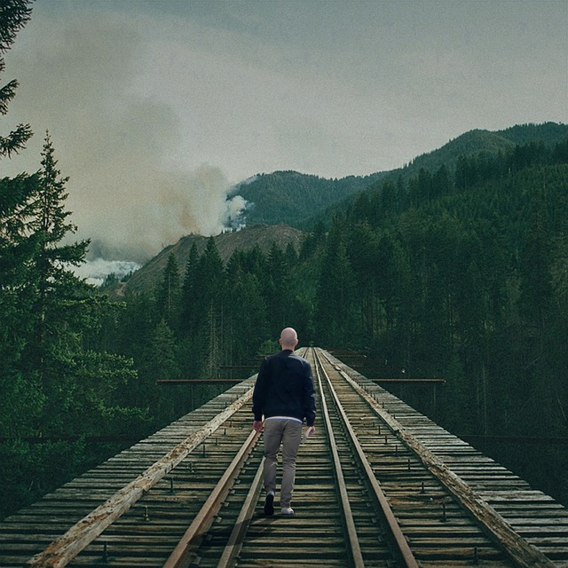
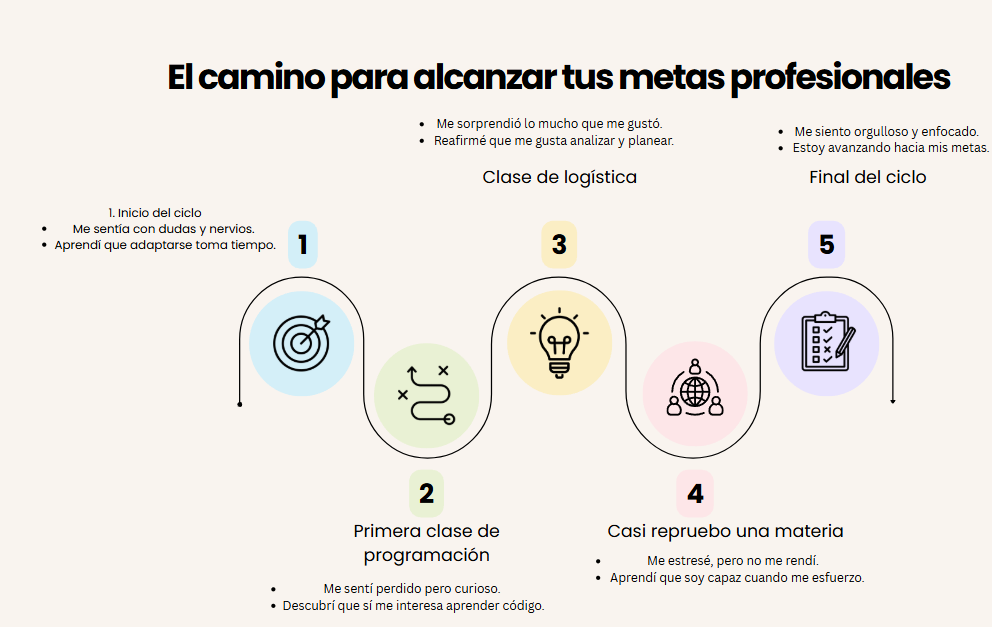

## 🪞 Diario de Transformación

### 🪞 ¿Quién era yo al comenzar este ciclo?
Era un estudiante con conocimientos muy básicos, entendía lo justo sobre computadoras y algo mínimo de código. Al principio pensé que esta carrera no era para mí, sobre todo por las matemáticas. Sentía nervios, pero con el tiempo me fui adaptando y empezó a gustarme más.

### 🔁 ¿Qué ha cambiado en mi forma de actuar, pensar o relacionarme?
He cambiado bastante. Ahora pienso más antes de actuar, analizo todo con más detalle, incluso las cosas pequeñas. También mejoró mi forma de ver el mundo y de relacionarme con los demás.

### 🌟 ¿Qué fue lo más valioso que aprendí sobre mí mism@?
Aprendí que, aunque me sienta al borde de rendirme, puedo levantarme. Si soy constante y me esfuerzo, puedo lograr cosas que antes ni imaginaba.

 

### 💡 ¿Estoy más cerca de lo que quiero ser o lograr?
Todavía me falta camino, pero estoy en proceso. Sé que no estoy donde quiero, pero sí mucho más cerca que al inicio.

## 📸 Línea del Tiempo Emocional

### 1. Inicio del ciclo escolar
- **¿Cómo me sentí?** Confundido, con dudas y nervios sobre si la carrera era para mí.
- **¿Qué aprendí o reafirmé sobre mí?** Que es normal tener miedo al principio, pero con el tiempo uno se adapta.

###  2. Primera clase de programación
- **¿Cómo me sentí?** Algo perdido, pero también curioso.
- **¿Qué aprendí o reafirmé sobre mí?** Que me interesa entender cómo funcionan las cosas y que puedo aprender si me esfuerzo.

###  3. Descubrimiento de la logística
- **¿Cómo me sentí?** Sorprendido y motivado.
- **¿Qué aprendí o reafirmé sobre mí?** Que me gusta analizar y planear, y que tengo una mente lógica.

###  4. Casi repruebo una materia
- **¿Cómo me sentí?** Estresado, pero también determinado.
- **¿Qué aprendí o reafirmé sobre mí?** Que cuando me enfoco y soy constante, puedo superar cualquier obstáculo.

###  5. Final del ciclo escolar
- **¿Cómo me sentí?** Orgulloso y más claro sobre lo que quiero.
- **¿Qué aprendí o reafirmé sobre mí?** Que he crecido mucho y que estoy en el camino correcto hacia lo que quiero lograr.

